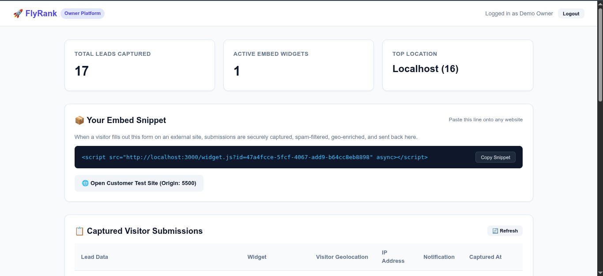
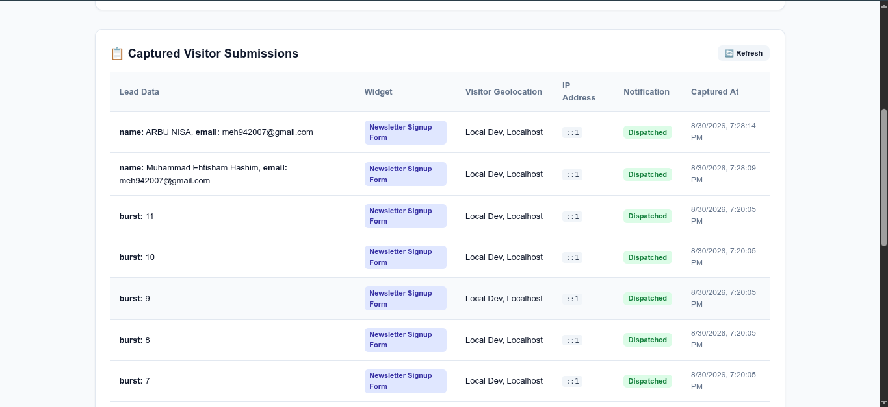

# FlyRank Embeddable Widget & Lead-Capture Platform

A resilient, multi-tenant lead capture and embeddable widget platform. Customers get one `<script>` tag to paste on any website — visitors fill the form, submissions are validated, spam-filtered, geo-enriched, and shown to the owner in a dashboard.

> Think Mailchimp signup forms or HubSpot lead popups — same machine, built from scratch.

---

## Architecture Overview

```
┌─────────────────────────────────────────────────────────────────┐
│  Widget Owner (JWT-authenticated)                               │
│    POST /api/auth/register|login  → receive JWT token           │
│    POST/GET/PUT/DELETE /api/widgets → tenant-isolated CRUD      │
│    GET  /api/dashboard/*          → submissions + stats + geo   │
└──────────────────────────┬──────────────────────────────────────┘
                           │ embed snippet returned per widget
                           ▼
┌─────────────────────────────────────────────────────────────────┐
│  Customer Website  (any origin — e.g. http://localhost:5500)    │
│    <script src="http://localhost:3000/widget.js?id=abc123">     │
│      ↳ GET /widgets/:id/config  (public · CORS · max-age=60)    │
│      ↳ Renders form dynamically in customer's page              │
└──────────────────────────┬──────────────────────────────────────┘
                           │ visitor submits form
                           ▼
┌─────────────────────────────────────────────────────────────────┐
│  POST /api/submissions  (public · CORS · rate-limited)          │
│    ├── Boundary Validation (Zod — 400 on bad/empty/oversized)   │
│    ├── Honeypot Spam Filter (_hp field → 400 if bot)            │
│    ├── Per-IP Rate Limiting (429 after burst)                    │
│    ├── Geo Enrichment: ip-api.com → ipapi.co → null fallback    │
│    ├── Idempotency (duplicate key → existing record returned)   │
│    ├── Persist to PostgreSQL (linked to widget + tenant)        │
│    └── Async notification side-effect (failure never blocks)    │
└─────────────────────────────────────────────────────────────────┘
```

---

## Stack

| Layer | Technology |
|---|---|
| Runtime | Node.js (ESM) |
| Framework | Express 4 |
| Database | PostgreSQL 16 (Docker) |
| ORM / Migrations | Drizzle ORM + raw SQL migrations |
| Validation | Zod |
| Auth | JWT (jsonwebtoken) + bcryptjs |
| Package Manager | pnpm |
| AI Assistant | Antigravity by Google DeepMind |

### Why Drizzle ORM (not Prisma)

Prisma was the first choice but **failed to install on Ubuntu** — it downloads large native binary engines (`@prisma/engines`) at install time, which timed out repeatedly on this machine. Drizzle ORM was chosen as the replacement because:
- Zero native binaries — pure JavaScript, installs instantly
- Works directly on top of a plain `pg.Pool` connection
- Schema is just TypeScript/JavaScript — no separate `.prisma` file needed

### Why there are `.sql` files in `backend/src/db/migrations/`

Drizzle can auto-generate and run migrations, but for this capstone **raw SQL migration files** were used intentionally:
- They are explicit and readable — anyone can open `001_create_users.sql` and see exactly what schema was created
- They run in order via a simple custom runner (`migrate.js`) that tracks which files have already been applied
- This satisfies the capstone's requirement of *"schema as migrations"* in a way that is easy to audit and verify
- No magic — what you see in the `.sql` file is exactly what runs against PostgreSQL

---

## Quick Start

### Prerequisites
- Node.js >= 20
- pnpm >= 9
- Docker Engine / Docker Desktop

### 1. Clone & Install
```bash
git clone https://github.com/<your-username>/flyrank-capstone-widget-platform
cd flyrank-capstone-widget-platform
pnpm install
```

### 2. Environment Setup
```bash
cp .env.example backend/.env
# Edit backend/.env if needed — defaults work out of the box
```

### 3. Start Database
```bash
docker compose up -d
# Wait for health check: docker compose ps
```

### 4. Run Migrations & Seed
```bash
cd backend
pnpm migrate   # Creates tables: users, widgets, submissions
pnpm seed      # Creates demo owner + newsletter widget
```

Seed creates:
- **Owner:** `demo@flyrank.com` / `password123`
- **Widget:** "Newsletter Signup Form" with embed snippet ready

### 5. Start the API Server
```bash
pnpm dev       # Development (watch mode)
# or
pnpm start     # Production
```

API running at: **`http://localhost:3000`**
Owner Dashboard UI: **`http://localhost:3000/dashboard`**

### 6. Start Customer Test Site (Second Origin)
```bash
# In a new terminal, from project root:
node test-site/serve.js
```
Customer site at: **`http://localhost:5500`**

### 7. Verify Everything Works
```bash
curl http://localhost:3000/health
```
Expected: `{"status":"ok","database":"connected",...}`

> **Dashboard preview** — after logging in at `http://localhost:3000/dashboard`:



---

## Verification

### Option A — Automated (All 6 Probes at Once)

The test script is at **`backend/src/test_probes.js`** (127 lines). It spins up a temporary test tenant, creates a widget, fires all 6 probes against the live API, and prints pass/fail for each.

With the backend running (`pnpm dev`), in a separate terminal:

```bash
cd backend
pnpm test:probes
# runs: node src/test_probes.js
```

Expected output:
```
====================================================
 FlyRank Capstone — Automated Acceptance Probes Test
====================================================

[Setup] Registering test tenant...
✓ Tenant created: tester_xxx@example.com

[Setup] Creating test widget...
✓ Widget created: "Feedback Widget"
  Snippet: <script src="http://localhost:3000/widget.js?id=..." async></script>

--- PROBE 1: Valid Submission & Dashboard Visibility ---
✓ Submission stored: <uuid>
✓ PROBE 1 PASSED: Found in dashboard list (Total: 1)

--- PROBE 2: Boundary Validation ---
✓ PROBE 2 PASSED: Malformed input properly rejected (Zod validation)

--- PROBE 4: Geolocation Enrichment Fallback ---
✓ Real IP (8.8.8.8) enriched -> Country: United States, City: Ashburn, Provider: ip-api.com
✓ Local IP degraded gracefully -> Country: Localhost, Provider: local
✓ PROBE 4 PASSED: Graceful degradation holds.

--- PROBE 5: Non-blocking Side Effect ---
✓ Side effect executed cleanly (success=true)
✓ PROBE 5 PASSED: Main path never blocked.

--- PROBE 6: Honeypot Spam Prevention ---
✓ Bot submission flagged: isSpam=true
✓ PROBE 6 PASSED: Bot submission rejected by pipeline

====================================================
 ALL ACCEPTANCE PROBES VERIFIED SUCCESSFULLY! ✓
====================================================
```

> **Note on Probe 3 (Rate Limiting):** The burst test is not in the automated script because it consumes rate limit quota and would interfere with the other probes. Run it manually via the curl loop in Option C below.

---

### Option B — Manual Browser Demo (See It Live)

**Step 1 — Open the Owner Dashboard**
```
http://localhost:3000/dashboard
```
Login with: `demo@flyrank.com` / `password123`

You will see your embed `<script>` tag, lead stats, and a submissions table (empty at first).

**Step 2 — Open the Customer Website** *(different origin)*
```
http://localhost:5500
```
This is a separate website on a different port (different origin). It has your widget embedded via the `<script>` tag.

**Step 3 — Submit the Form**

Fill in Name and Email on the customer site → click **Subscribe Now**.

The form submits cross-origin to `http://localhost:3000/api/submissions`.

**Step 4 — See the Lead in Your Dashboard**

Switch back to `http://localhost:3000/dashboard` → click **Refresh**.

The submission appears in the table with country, city, IP address, and timestamp — captured from the visitor's IP via geo enrichment.



---

### Option C — Quick curl Check

```bash
# Health
curl http://localhost:3000/health

# Register & get a token
curl -s -X POST http://localhost:3000/api/auth/login \
  -H "Content-Type: application/json" \
  -d '{"email":"demo@flyrank.com","password":"password123"}'

# Submit a lead (cross-origin)
curl -i -X POST http://localhost:3000/api/submissions \
  -H "Origin: http://localhost:5500" \
  -H "Content-Type: application/json" \
  -d '{"widgetId":"<widget-id-from-dashboard>","data":{"name":"Test","email":"t@t.com"}}'
# → HTTP 201 Created

# Trigger 429 (burst test)
for i in {1..18}; do curl -s -o /dev/null -w "Req $i: %{http_code}\n" \
  -X POST http://localhost:3000/api/submissions \
  -H "Content-Type: application/json" \
  -d '{"widgetId":"<id>","data":{"x":1}}'; done
# → First ~11 succeed (201), then 429s kick in

# Honeypot test
curl -i -X POST http://localhost:3000/api/submissions \
  -H "Content-Type: application/json" \
  -d '{"widgetId":"<id>","data":{"name":"Bot"},"_hp":"filled-by-bot"}'
# → HTTP 400 "Submission rejected by spam protection filter"
```

---

## API Reference

| Method | Endpoint | Auth | Description |
|---|---|---|---|
| GET | `/health` | None | Service & DB status |
| GET | `/dashboard` | None | Owner dashboard UI (browser) |
| POST | `/api/auth/register` | None | Register owner account |
| POST | `/api/auth/login` | None | Login, receive JWT |
| POST | `/api/widgets` | JWT | Create widget |
| GET | `/api/widgets` | JWT | List tenant's widgets |
| GET | `/api/widgets/:id` | JWT | Get single widget |
| PUT | `/api/widgets/:id` | JWT | Update widget |
| DELETE | `/api/widgets/:id` | JWT | Delete widget |
| GET | `/widget.js` | None | Embed JS bundle (immutable cache) |
| GET | `/widgets/:id/config` | None | Widget config (60s cache, CORS) |
| POST | `/api/submissions` | None | Public form submission |
| GET | `/api/dashboard/submissions` | JWT | Paginated submissions list |
| GET | `/api/dashboard/stats` | JWT | Totals + counts over time |
| GET | `/api/dashboard/geo` | JWT | Country/city breakdown |

### Auth Header
```
Authorization: Bearer <token>
```

### Example: Submit Form (Cross-Origin)
```bash
curl -X POST http://localhost:3000/api/submissions \
  -H "Origin: http://localhost:5500" \
  -H "Content-Type: application/json" \
  -d '{"widgetId":"<uuid>","data":{"name":"Jane","email":"jane@example.com"}}'
```

---

## Running Acceptance Tests

```bash
cd backend
pnpm test:probes
```

Verifies all 6 capstone probes automatically. Expected output:
```
ALL ACCEPTANCE PROBES VERIFIED SUCCESSFULLY! ✓
```

---

## Project Structure

```
flyrank-capstone-widget-platform/
├── backend/
│   ├── src/
│   │   ├── config/        # env.js — environment parsing
│   │   ├── db/            # schema, migrations, pool, seed
│   │   ├── middleware/     # auth, cors, rateLimiter, validate, errorHandler
│   │   ├── validators/     # Zod schemas (auth, widget, submission)
│   │   ├── services/      # business logic (auth, widget, submission, geo, spam, notification, dashboard)
│   │   ├── controllers/   # HTTP controllers
│   │   ├── routes/        # route definitions
│   │   └── index.js       # Express entry point
│   └── package.json
├── public/
│   ├── widget.js          # Embeddable IIFE script
│   └── dashboard.html     # Owner dashboard UI
├── test-site/
│   ├── index.html         # Customer test website (origin: localhost:5500)
│   └── serve.js           # Static file server
├── docker-compose.yml     # PostgreSQL 16 container
├── .env.example           # Environment variable template
├── capstone.yaml          # Submission manifest
├── EVIDENCE.md            # Acceptance probe proofs
└── BUILDLOG.md            # AI usage + decision log
```

---

## Limitations

- **Email is simulated:** The notification side-effect logs to console only — no actual email is sent. What's graded is that its failure doesn't block submissions (which is proven in Probe 5).
- **Geo uses free public APIs:** `ip-api.com` (45 req/min) and `ipapi.co` (~1,000/day). Rate limits apply in heavy testing. Localhost IPs resolve to a `local` fallback.
- **No hosting required:** The entire platform runs locally. The "second origin" is `localhost:5500` — a second local port, per spec.
- **Widget UI is minimal:** A simple form with a submit button. The grade lives in the backend, not the CSS.
- **No real CDN:** `widget.js` is served directly from Express with correct immutable cache headers. A CDN would sit in front in production.
- **ORM swap:** Prisma was replaced with Drizzle ORM due to binary engine download failures on Ubuntu (timeout on `@prisma/engines`). Drizzle has zero native binaries.

---

## Evidence & Build Log

- **[EVIDENCE.md](EVIDENCE.md)** — Pasted curl transcripts and terminal outputs proving all 6 acceptance probes.
- **[BUILDLOG.md](BUILDLOG.md)** — Development session log: where AI assisted, what was wrong, what changed.
